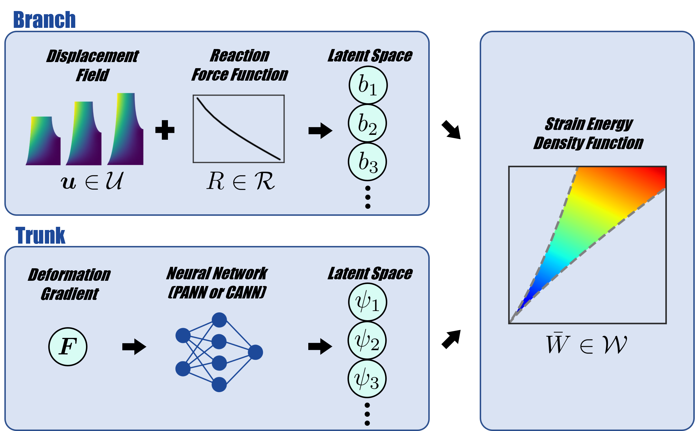

# Physics-Augmented Neural Operators (PANO) and Constitutive Artificial Neural Operators (CANO)

Characterizing the mechanical response of materials traditionally requires solving optimization problems in which model parameters are calibrated or trained to minimize the discrepancy between model predictions and experimental data. This process can be computationally expensive and time-consuming. To overcome this limitation, we propose two neural operator architectures that directly map experimentally measured data to the constitutive functions governing the mechanical response of the material: Physics-Augmented Neural Operators (PANO) and Constitutive Artificial Neural Operators (CANO). The proposed neural operators approximate the mapping between the infinite-dimensional input space of full-field displacement measurements and net reaction forces, and the infinite-dimensional output space of hyperelastic strain-energy density functions. The displacement fields are encoded through Laplacian eigenfunctions to obtain discretization-independent and noise-robust predictions. We constrain the output space to physically admissible material models that satisfy fundamental physical requirements by design. Here, we focus on isotropic, incompressible hyperelasticity and assume that the material properties are uniform across the specimen. The neural operators are trained on simulated data tuples of displacement fields and reaction force functions for a range of material models. Once trained, the neural operators enable near-instantaneous material characterization and require only a single forward pass to infer the strain-energy density function from a given experimental dataset. We test the predictive power of the neural operators for unseen data, noisy data, data with missing information, data from different spatial discretizations, and data from geometries of different sizes. We finally discuss the ill-posedness of the inverse material characterization problem and show that constraining the output function space of our neural operator framework sufficiently regularizes the problem. The trained neural operators enable rapid and robust discovery of polyconvex strain-energy density functions while avoiding the need to solve computationally expensive inverse problems.

## Contact

Moritz Flaschel moritz.flaschel@fau.de

## References

1. Flaschel, Moritz; Liu, Burigede; Kuhl, Ellen. *Neural operators solve inverse problems for constitutive model discovery*. Computer Methods in Applied Mechanics and Engineering, 2026. DOI: [10.48550/arXiv.2607.15049](http://doi.org/10.48550/arXiv.2607.15049)